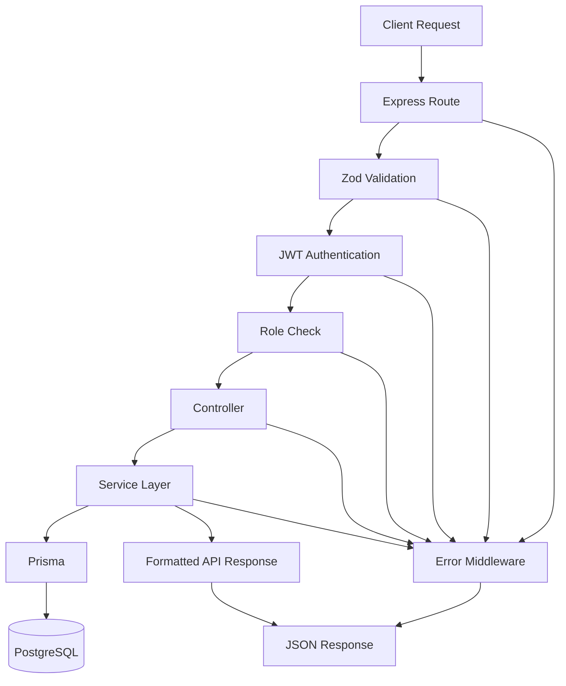
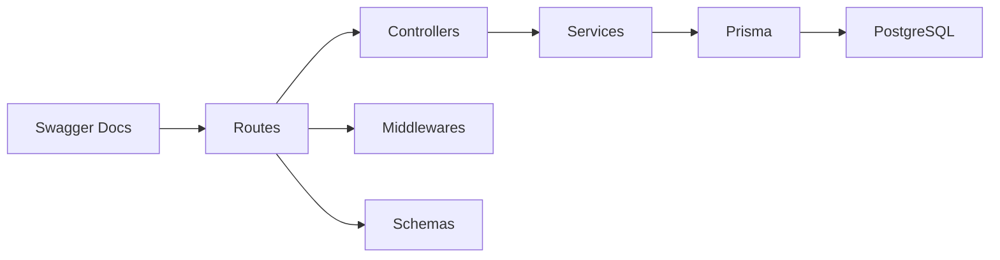
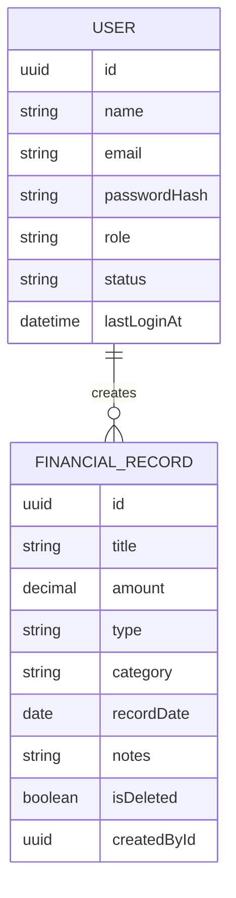
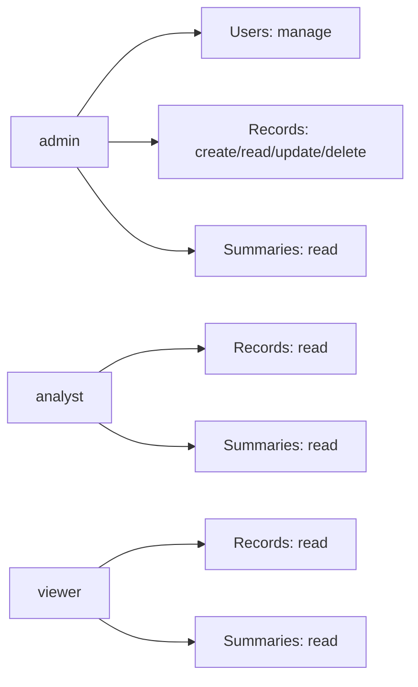
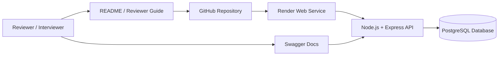

# Architecture Notes

## Goal

This backend is designed as a maintainable finance API that demonstrates:

- clear API structure
- role-based access control
- reliable validation and error handling
- practical data modeling
- reviewer-friendly documentation and deployment

## Request Flow

The high-level request lifecycle is:

1. An Express route receives the request
2. Request validation runs using Zod schemas
3. Authentication middleware verifies the JWT when required
4. Role middleware checks whether the current user has the needed permission
5. The controller coordinates the request and delegates business logic
6. Service functions execute database operations through Prisma
7. A normalized API response is returned
8. Centralized error middleware handles expected and unexpected failures

## Layer Responsibilities

### Routes

Routes define endpoint paths, attach middleware, and map HTTP actions to controllers.

### Controllers

Controllers stay lightweight and focus on request parsing, status codes, and response formatting.

### Services

Services contain business logic, filtering rules, pagination behavior, and Prisma queries. This keeps controllers thin and makes the logic easier to evolve.

### Schemas

Schemas use Zod to validate request body, params, and query inputs before controller logic runs.

### Middlewares

Middlewares are used for:

- authentication
- authorization
- validation
- centralized error handling

This keeps cross-cutting concerns reusable and consistent.

## Data Model

### User

The `User` model stores:

- identity fields
- password hash
- role
- status
- last login timestamp

### FinancialRecord

The `FinancialRecord` model stores:

- title
- amount
- type
- category
- record date
- notes
- soft delete flag
- creator reference

The schema uses enums for roles, user status, and record type so permission and data rules remain explicit.

## Access Control Design

The backend enforces authorization at the API layer instead of relying on frontend restrictions.

- `admin` can manage users and mutate records
- `analyst` can read records and summaries
- `viewer` can read records and summaries

This keeps permissions easy to audit and reason about.

## Summary Logic

The summary service computes:

- total income
- total expenses
- net balance
- total record count
- category totals
- monthly trends

This moves the dashboard aggregation logic into the backend, which keeps frontend clients simpler and ensures consistent calculations.

## Deployment View

The hosted review setup is designed so a reviewer can access the API without running a frontend locally.

## Trade-offs

- The project is backend-only by design to focus on API architecture and business logic quality
- JWT auth was preferred over a more complex session setup to keep the implementation practical and portable
- Soft delete was added for safer record management, but a full audit log was intentionally left out for scope control
- Tests currently focus on key infrastructure checks; deeper end-to-end coverage would be the next quality upgrade

## Future Improvements

- expand API integration tests for auth, record CRUD, and summary flows
- add rate limiting for auth-sensitive endpoints
- add refresh token support
- add audit logging for admin actions
- add coverage reporting in CI
