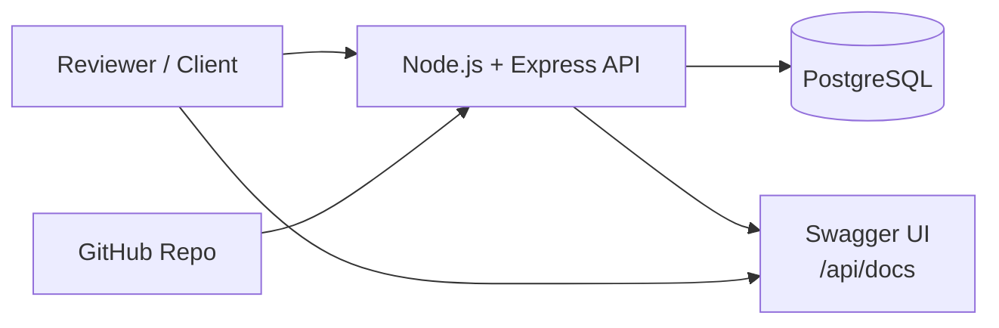

# Deployment

This project is a Node.js + Express API backed by PostgreSQL (via Prisma). It can be deployed to any platform that supports:

- Node.js (>= 20)
- a PostgreSQL database
- environment variables for configuration

The repository includes `docker-compose.yml` to run PostgreSQL locally for development/review.



## Environments

- **Development:** `npm run dev` (hot reload via `tsx`)
- **Production:** `npm run build` then `npm start`

## Required Environment Variables

See `.env.example` for a safe template.

| Variable | Purpose |
| --- | --- |
| `NODE_ENV` | `development` / `production` / `test` |
| `PORT` | HTTP port |
| `DATABASE_URL` | PostgreSQL connection string |
| `JWT_SECRET` | Signing secret for access tokens |
| `JWT_EXPIRES_IN` | Token TTL (e.g., `7d`) |
| `CLIENT_ORIGIN` | CORS origin(s) (`*` or comma-separated list) |

## Database Migrations

This project uses Prisma migrations in `prisma/migrations/`.

- **Development (creates migrations):**
  - `npm run prisma:migrate -- --name init`
- **Production (applies existing migrations):**
  - `npm run prisma:migrate:deploy`

## Common Deployment Flow

1. Provision a PostgreSQL database and set `DATABASE_URL`.
2. Set `JWT_SECRET` to a long random value (do not reuse the `.env.example` placeholder).
3. Install dependencies.
4. Run migrations (deploy mode).
5. Build and start the server.

Example:

```bash
npm ci
npm run prisma:generate
npm run prisma:migrate:deploy
npm run build
npm start
```

## Notes for Hosting Platforms (Render/Fly/Heroku-like)

- Ensure the platform sets `PORT` (or set it yourself).
- Ensure the runtime can reach the PostgreSQL host and accepts TLS requirements if the provider enforces them.
- Run `prisma generate` during build or as part of the deploy process.
